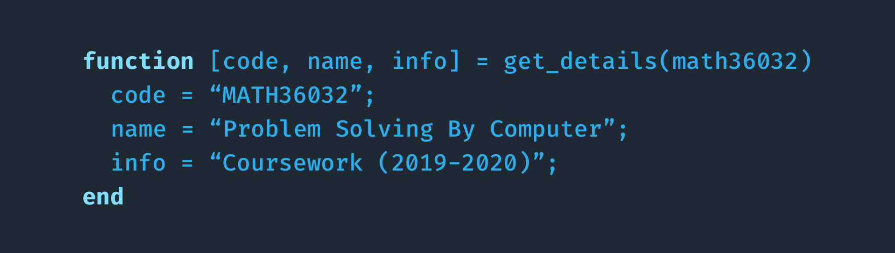

### About
🎲 Repository for my MATH36032 - Problem Solving By Computer coursework (2019-2020).

### Project 1 - Three Short Questions
- [Question 1: Cubic Taxicab Number](ex1/ex1)
  The task for this question was to find and return the closest cubic taxicab number N (integer)
larger or equal to a given input. A cubic taxicab number is the result of adding together two
unique pairs of perfect cubes.
- [Question 2: Catalan's Constant](ex1/ex2) 
  This task was to find two positive integers p and q, such that p/q is the best approximation
to Catalan’s constant G, under the constraint, p + q is less than a positive integer N .
- [Question 3: Sum of Reciprocal Squares with Prime Factors](ex1/ex3) 
  Approximate Dirichlet series for the Liouville function to a reasonable degree of accuracy
- [Report for Project 1](ex1/report)

### Project 2 - Projectile Motion
- [Source Code](ex2/src)
- [Report for Project 2](ex2/report)

### Project 3 - e-Commerce Data Analysis
A data science project answring questions on a large e-commerce sales dataset
- [Source Code](ex3/src)
- [Data Set](ex3/src/purchasing_order.csv)
- [Report for Project 3](ex3/report)
